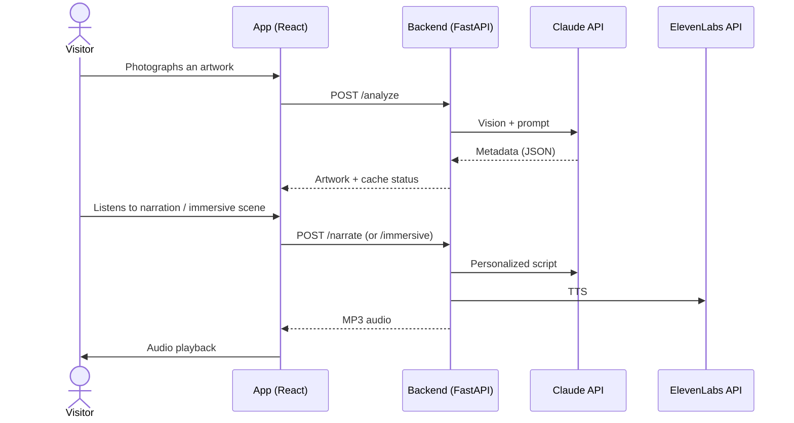
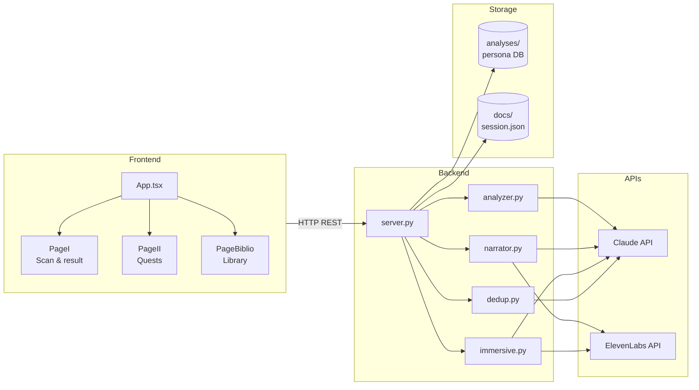

# Animart.ai 🏛️

A mobile museum guide: the visitor **photographs an artwork**, Claude analyzes it, then the app offers a **personalized audio experience** (narration or immersive scene) tailored to the visitor's profile. Includes per-artist quests and a session library.

All generated content is in **English**. The JSON analysis keys remain in French (`titre_probable`, `artiste_probable`, …).

---

## How it works

UML sequence diagram — from scan to audio:



The visitor profile (questionnaire → `serious` / `fun` persona) is stored in `docs/long_term_memory.md` and drives the narration tone. Scanned artworks are cached in `analyses/{persona}/`; the current session lives in `docs/session.json`.

### Component diagram (UML)

Relationships between packages and files in the repo:



---

## Setup

```bash
uv sync                       # install Python dependencies
cd frontend && npm install    # install frontend dependencies
```

Create a `.env` file at the root:

```env
ANTHROPIC_API_KEY=sk-ant-...
ELEVENLABS_API_KEY=sk_...
```

`ffmpeg` must be installed on the machine (immersive audio). Python ≥ 3.11.

---

## Run

```bash
cd frontend && npm run build   # once, or after each UI change
cd ..
uv run python -m backend.server
```

The server listens on **port 8000** and prints a LAN URL for phone access (same Wi‑Fi).

Optional — analyze an image via CLI:

```bash
uv run python -m backend.main path/to/photo.jpg
```

Optional — sync the ElevenLabs voice catalog:

```bash
uv run python -m immersive_scene.sync_voices
```

---

## Files

| File / folder | Role |
|---|---|
| `backend/server.py` | FastAPI app, routes, static files (`frontend/dist`) |
| `backend/analyzer.py` | Claude vision → artwork JSON |
| `backend/dedup.py` | Claude agent: same artwork or new entry |
| `backend/narrator.py` | Claude script + ElevenLabs TTS |
| `backend/immersive.py` | Bridge to the immersive scene pipeline |
| `backend/matcher.py` | Artist name → museum / quest id |
| `backend/profile.py` | Questionnaire → persona |
| `frontend/src/PageI.tsx` | Onboarding, scan, audio result |
| `frontend/src/PageII.tsx` | Quests (Louvre, Orsay, Pompidou) |
| `frontend/src/PageBiblio.tsx` | Session library |
| `immersive_scene/` | Multi-voice immersive audio pipeline |
| `analyses/{serious,fun}/` | Shared per-persona cache (JSON, photos, audio) |
| `docs/prompt.md` | Vision analysis prompt |
| `docs/narration_prompt.md` | Narration prompt |

---

## API Routes

| Method | Route | Description |
|---|---|---|
| `POST` | `/profile` | Save visitor profile |
| `POST` | `/new-profile` | Reset session (persona cache untouched) |
| `POST` | `/analyze` | Photo → artwork JSON |
| `POST` | `/narrate` | Narration MP3 |
| `POST` | `/immersive` | Immersive scene MP3 + captions |
| `GET` | `/library` | Session library |
| `GET` | `/artwork/{key}` | Full artwork JSON |
| `GET` | `/photos/{key}` · `/audio/{key}` · `/immersive-audio/{key}` | Media files |

---

## Notes

- Only `/new-profile` clears the session; the `analyses/` cache persists.
- Each scan may trigger an extra Claude dedup call if the cache is non-empty.
- Narration and immersive are **two distinct modes** — the visitor picks one per artwork.
